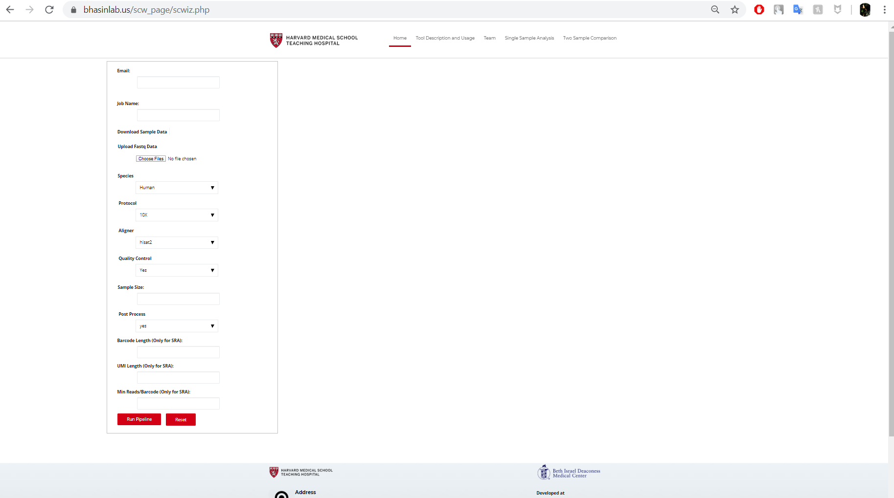

While working as a Research Intern at Beth Israel Deaconess Medical Center / Harvard Medical School, Boston, I gained substantial knowledge in Single Cell Genomics as well as various Bioinformatic tools and pipelines. I was primarily responsible to work on to design and develop a scRNA-seq pre-processing pipeline using Perl/Python/R and BASH to process raw FASTQ files into feature-barcode matrices and perform pre-processing, data normalization, quality control to differentially expressed genes, annotation of clusters and final visualization.

I have also developed tools like FASTQ de-multiplexer, barcode cleaner and filtering low quality reads, which I was able to benchmark against with the existing Alona sc-RNA-seq pipeline tools to see positive difference between my tools and the Alona’s.

Finally, I wrapped the whole pipeline up into a web tool using PHP with email support to send output to the user when the job is finished.

In this project I gained experience with single cell omics, work-flow and web application design and associated technologies.
 
Source: <a href="https://bhasinlab.us/scw_page/scwiz.php">Single Cell Wizard</a>
